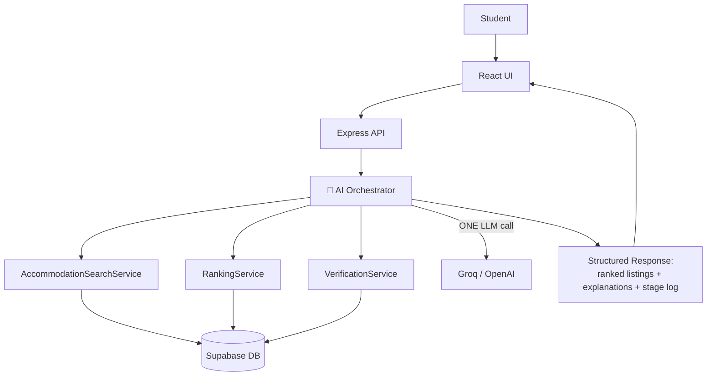

# CampusNest AI

**Agentic AI, visible in one search.** A student types a natural language request —

> "I'm looking for a quiet hostel near KNUST under GHS 4,000 with good WiFi."

…and a single AI orchestrator reasons through the whole problem: it extracts intent, searches the database, ranks results, verifies listing quality, and explains every recommendation — all in ONE execution with exactly ONE LLM API call. Everything else is deterministic code.

## Tech Stack

React 19 · Vite · TypeScript · Express · Supabase · Groq (`openai/gpt-oss-120b`)

## How It Works



## Six Stages, One LLM Call

| # | Stage | What happens | AI? |
|---|----------------|-----------------------------------------------------------|-----|
| 1 | Intent | Deterministic keyword extraction (university, budget, gender, amenities) | — |
| 2 | Search | Filter listings in Supabase | — |
| 3 | Ranking | Score each listing against the extracted criteria | — |
| 4 | Verification | Deterministic quality checks (reviews, signals) | — |
| 5 | AI Reasoning | The **only** LLM call — weighs tradeoffs, writes explanations | ✅ |
| 6 | Recommendation | Merges deterministic ranking with AI reasoning | — |

## Features

- **Natural language search** — no forms, just plain English
- **Live pipeline tracking** — watch each stage run in real time via SSE (`GET /api/search/stream`)
- **Explanations with tradeoffs** — every recommendation says *why*, and what you're giving up
- **Deterministic verification** — listing quality checks keep the AI's output accountable

## Quick Start

Prerequisites: Node 20+, yarn, a Supabase project, a Groq API key.

```bash
yarn install

# configure environment
cp .env.example .env.local   # then fill in SUPABASE_URL, SUPABASE_ANON_KEY, OPENAI_API_KEY

# run client (port 5173) and server (port 3000) together
yarn dev
```

Open http://localhost:5173 and type a search.

## Project Structure

```
client/src/            React 19 + Vite UI (pages, components, services)
server/src/
  routes/              /api/search, /api/search/stream, /api/listings, /api/listing/:id
  services/
    ai-orchestrator/   the single entry point that coordinates everything
    accommodation-search/   Supabase queries (deterministic)
    ranking/           criteria-based scoring (deterministic)
    verification/      listing quality checks (deterministic)
  prompts/             LLM prompts — kept separate from code, easy to tweak
  middleware/          auth (search history for signed-in users)
supabase/              migrations + seed data (~25 KNUST listings)
docs/                  design docs and build philosophy
```

## Documentation

[Vision](docs/01-vision.md) · [Architecture](docs/02-architecture.md) · [Database](docs/03-database.md) · [AI Workers](docs/04-ai-workers.md)

## Deployment

`render.yaml` is included — connect the repo in the [Render](https://render.com) dashboard and set `SUPABASE_URL`, `SUPABASE_ANON_KEY`, `OPENAI_API_KEY` (plus `VITE_SUPABASE_*` for the client) as environment variables. In production the Express server also serves the built client, so one web service is enough.

## Scope

This is a demonstration project, not a production platform. One university, ~25 listings, no payments, no notifications — by design. The goal is to make agentic AI reasoning *visible and explainable*.